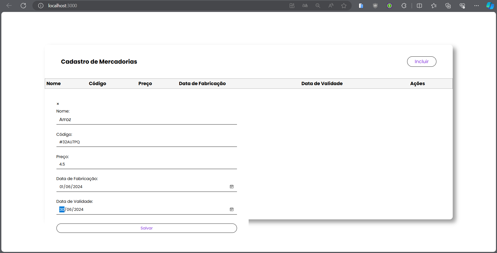
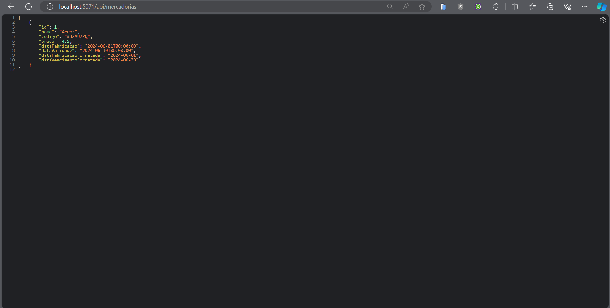
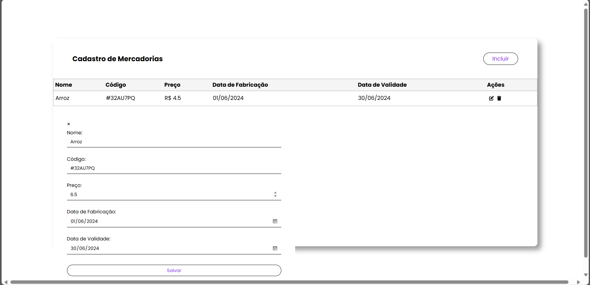
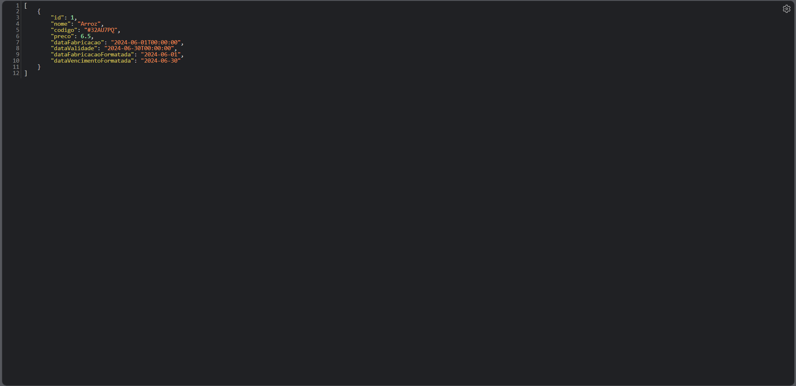
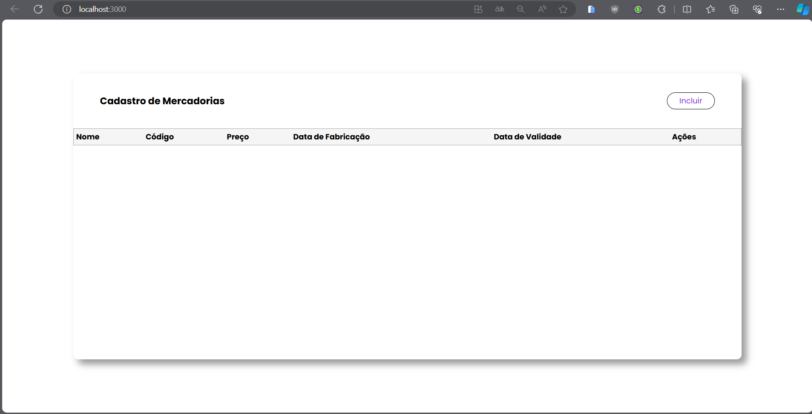
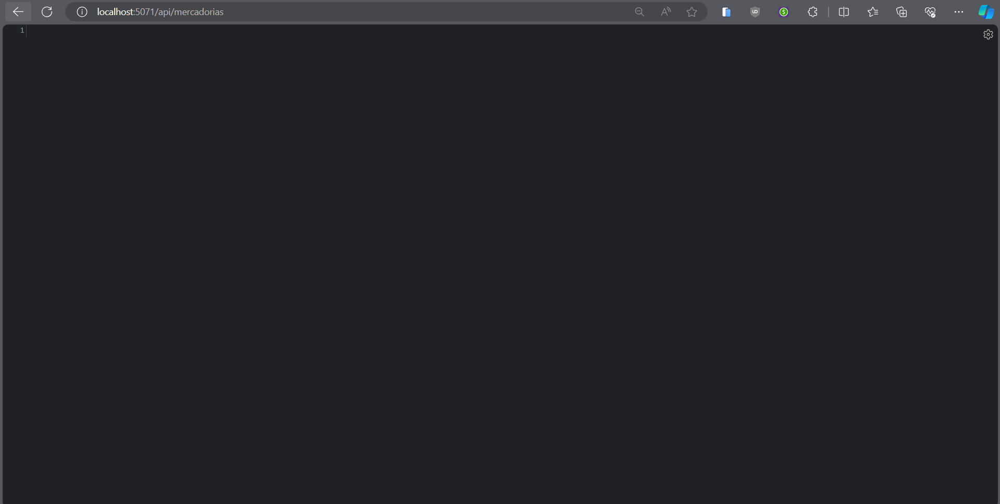

# Getting Started with Create React App

# Front-end
http://localhost:3000/
# Back-end
http://localhost:5071/api/mercadorias

# Capturas de Telas
**As imagens estão salvas na pasta: cadastro-mercadorias/src/assets/image**
` Cadastrando Mercadorias `

` Editando Mercadorias `

` Excluindo Mercadorias `

# Como utilizar
**Para começar, siga os passos abaixo:**
Para cadastrar uma mercadoria, primeiro clique no botão `Incluir`, que 
abrirá uma tela para fazer o cadastro da mercadoria. Para terminar, clique 
no botão `Salvar` para salvar a mercadoria. Após isso atualize o "Back-end"
para visualizar o resultado

**Atualizando/Excluindo a mercadoria**
Para atualizar ou excluir a mercadoria cadastrada, clique em um dos botões na 
coluna de ações, sendo o ícone da esquerda para atualizar. Após isso, abrirá a 
mesma tela de cadastro para você poder efetuar a atualização dos dados. O ícone 
da direita é para excluir. Após isso, atualize o "Back-end" para visualizar o 
resultado.