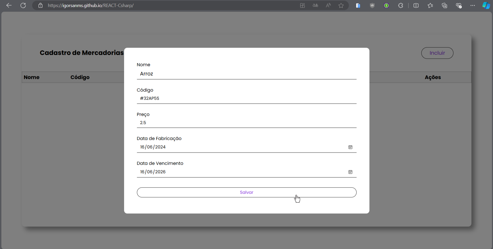
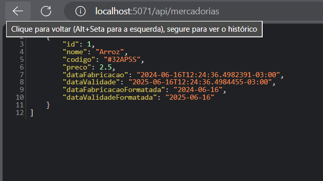

# Transformação da SPA em React com C#

## Índice

- [Descrição do Projeto](#descrição-do-projeto)
- [Objetivo](#objetivo)
- [Requisitos Técnicos](#requisitos-técnicos)
- [Tecnologias Utilizadas](#tecnologias-utilizadas)
- [Imagens da Aplicação](#imagens-da-aplicação)
- [Funcionalidades](#funcionalidades)
- [Estrutura do Projeto](#estrutura-do-projeto)
- [Como utilizar](#como-utilizar)

## Descrição do Projeto

Este projeto transforma uma Single Page Application (SPA) desenvolvida com JavaScript puro em uma aplicação web utilizando React no front-end e C# no back-end. A aplicação realiza operações CRUD em uma entidade de mercadorias.

## Objetivo

Ganhar experiência na criação de uma aplicação web utilizando React e C#, refatorando a SPA para React e implementando um web service em C# para manipular os dados da aplicação.

## Requisitos Técnicos

- **Front-end com React:**
  - Refatorar a interface da aplicação para utilizar React.
  - Utilizar componentes do React para estruturar a interface de forma modular.
  - Manter as funcionalidades de CRUD para a entidade escolhida.
  
- **Back-end com C#:**
  - Implementar um web service utilizando C# e .NET.
  - Oferecer endpoints para realizar as operações CRUD na entidade escolhida.
  - Utilizar um banco de dados In Memory do .NET para persistir os dados.

## Tecnologias Utilizadas

- **Front-end:** React, JavaScript, HTML, CSS
- **Back-end:** C#, .NET Core, Entity Framework Core
- **Ferramentas:** Visual Studio Code, Git, GitHub

## Imagens da Aplicação
- **Adicionando Itens:**




- **Atualizando Itens:**


- **Adicionando Mais Itens:**


- **Removendo Itens:**


## Funcionalidades

- **CRUD de Mercadorias:**
  - **Create:** Adicionar uma nova mercadoria.
  - **Read:** Visualizar a lista de mercadorias.
  - **Update:** Editar uma mercadoria existente.
  - **Delete:** Remover uma mercadoria.

## Estrutura do Projeto

### Front-end
```plaintext
src/
├── components/
│ ├── Header.js
│ ├── Modal.js
│ └── Table.js
├── styles/
│ ├── App.css
│ └── index.css
├── Api.js
├── App.js
├── index.js
└── App.test.js
```
### Back-end
```plaintext
CadastroMercadoriasAPI/
├── Controllers/
│ ├── MercadoriasController.cs
├── Data/
│ ├── AppDbContext.cs
├── Models/
│ ├── Mercadoria.cs
├── Program.cs
└── appsettings.json
```

## Como utilizar

**Para começar, siga os passos abaixo:**
Para cadastrar uma mercadoria, primeiro clique no botão `Incluir`, que 
abrirá uma tela para fazer o cadastro da mercadoria. Para terminar, clique 
no botão `Salvar` para salvar a mercadoria. Após isso atualize o "Back-end"
para visualizar o resultado

**Atualizando/Excluindo a mercadoria**
Para atualizar ou excluir a mercadoria cadastrada, clique em um dos botões na 
coluna de ações, sendo o ícone da esquerda para atualizar. Após isso, abrirá a 
mesma tela de cadastro para você poder efetuar a atualização dos dados. O ícone 
da direita é para excluir. Após isso, atualize o "Back-end" para visualizar o 
resultado.

